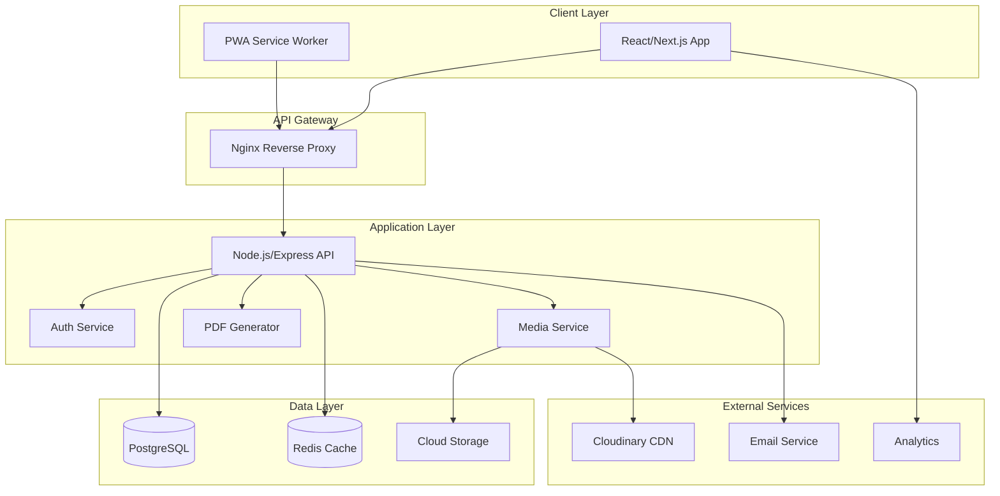
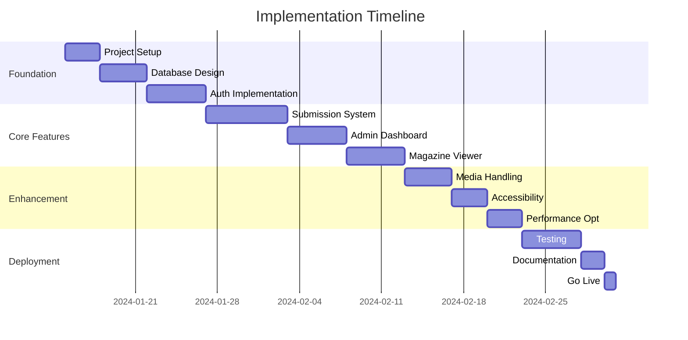

# Technical Architecture Document

## System Architecture Diagram



## Detailed Component Specifications

### 1. Frontend Architecture

```typescript
// Folder Structure
/src
  /components
    /common        # Shared components
    /forms         # Form components with validation
    /layouts       # Page layouts
    /accessibility # A11y specific components
  /features
    /submission    # Content submission feature
    /magazine      # Magazine viewer feature
    /admin         # Admin dashboard
  /hooks           # Custom React hooks
  /services        # API communication layer
  /stores          # State management
  /utils           # Helper functions
  /styles          # Global styles and themes
```

### 2. Backend Service Architecture

```typescript
// Service Layer Pattern
/server
  /src
    /controllers   # Request handlers
    /services      # Business logic
    /repositories  # Data access layer
    /middleware    # Express middleware
    /validators    # Input validation schemas
    /utils         # Shared utilities
    /config        # Configuration management
    /migrations    # Database migrations
    /seeds         # Test data seeds
```

### 3. Database Design (Detailed)

```sql
-- Enhanced schema with accessibility features
CREATE TABLE users (
    id UUID PRIMARY KEY DEFAULT gen_random_uuid(),
    email VARCHAR(255) UNIQUE,
    name VARCHAR(255) NOT NULL,
    role VARCHAR(50) NOT NULL CHECK (role IN ('contributor', 'admin', 'viewer')),
    accessibility_preferences JSONB DEFAULT '{}',
    created_at TIMESTAMP DEFAULT CURRENT_TIMESTAMP,
    updated_at TIMESTAMP DEFAULT CURRENT_TIMESTAMP
);

CREATE TABLE submissions (
    id UUID PRIMARY KEY DEFAULT gen_random_uuid(),
    user_id UUID REFERENCES users(id),
    category VARCHAR(100) NOT NULL,
    content_type VARCHAR(50) NOT NULL CHECK (content_type IN ('text', 'image', 'audio', 'drawing')),
    status VARCHAR(50) DEFAULT 'pending' CHECK (status IN ('pending', 'approved', 'rejected', 'archived')),
    text_content TEXT,
    media_metadata JSONB,
    accessibility_text TEXT, -- Alt text or transcription
    submitted_at TIMESTAMP DEFAULT CURRENT_TIMESTAMP,
    reviewed_at TIMESTAMP,
    reviewed_by UUID REFERENCES users(id),
    review_notes TEXT
);

CREATE TABLE magazines (
    id UUID PRIMARY KEY DEFAULT gen_random_uuid(),
    title VARCHAR(255) NOT NULL,
    description TEXT,
    version VARCHAR(50) NOT NULL,
    status VARCHAR(50) DEFAULT 'draft' CHECK (status IN ('draft', 'published', 'archived')),
    theme JSONB DEFAULT '{}',
    published_at TIMESTAMP,
    published_by UUID REFERENCES users(id),
    shareable_slug VARCHAR(255) UNIQUE,
    view_count INTEGER DEFAULT 0,
    is_public BOOLEAN DEFAULT false
);

-- Indexes for performance
CREATE INDEX idx_submissions_status ON submissions(status);
CREATE INDEX idx_submissions_user_id ON submissions(user_id);
CREATE INDEX idx_magazines_shareable_slug ON magazines(shareable_slug);
CREATE INDEX idx_magazines_status ON magazines(status);
```

### 4. API Specification (OpenAPI)

```yaml
openapi: 3.0.0
info:
  title: Community Magazine API
  version: 1.0.0

paths:
  /api/submissions:
    post:
      summary: Create new submission
      requestBody:
        content:
          multipart/form-data:
            schema:
              type: object
              properties:
                category:
                  type: string
                  enum: [my_news, saying_hello, my_say]
                text_content:
                  type: string
                  maxLength: 5000
                media:
                  type: string
                  format: binary
                accessibility_text:
                  type: string
      responses:
        201:
          description: Submission created
        400:
          description: Validation error
        413:
          description: File too large

  /api/magazines/{id}/publish:
    post:
      summary: Publish magazine
      parameters:
        - name: id
          in: path
          required: true
          schema:
            type: string
      responses:
        200:
          description: Magazine published
        403:
          description: Unauthorized
```

### 5. Security Implementation

```typescript
// Security Middleware Stack
const securityMiddleware = [
  helmet(),                    // Security headers
  rateLimit({                  // Rate limiting
    windowMs: 15 * 60 * 1000,
    max: 100
  }),
  mongoSanitize(),            // Prevent injection
  xss(),                      // XSS protection
  cors({                      // CORS configuration
    origin: process.env.ALLOWED_ORIGINS?.split(','),
    credentials: true
  })
];

// Content validation
const contentFilter = {
  maxTextLength: 5000,
  maxFileSize: 10 * 1024 * 1024, // 10MB
  allowedMimeTypes: [
    'image/jpeg', 'image/png', 'image/webp',
    'audio/mpeg', 'audio/wav', 'audio/webm'
  ],
  profanityFilter: true
};
```

### 6. Deployment Configuration

```yaml
# railway.toml
[build]
builder = "NIXPACKS"
buildCommand = "npm run build"

[deploy]
startCommand = "npm run start"
healthcheckPath = "/api/health"
healthcheckTimeout = 10

[variables]
NODE_ENV = "production"
PORT = "$PORT"

# docker-compose.yml for local development
version: '3.8'
services:
  app:
    build: .
    ports:
      - "3000:3000"
    environment:
      - DATABASE_URL=postgresql://user:pass@db:5432/magazine
      - REDIS_URL=redis://redis:6379
    depends_on:
      - db
      - redis
      
  db:
    image: postgres:15-alpine
    environment:
      POSTGRES_DB: magazine
      POSTGRES_USER: user
      POSTGRES_PASSWORD: pass
    volumes:
      - postgres_data:/var/lib/postgresql/data
      
  redis:
    image: redis:7-alpine
    ports:
      - "6379:6379"

volumes:
  postgres_data:
```

### 7. Performance Optimization Strategy

```javascript
// Caching Strategy
const cachingLayers = {
  browser: {
    staticAssets: '1 year',
    apiResponses: '5 minutes'
  },
  cdn: {
    images: '30 days',
    magazines: '7 days'
  },
  redis: {
    sessions: '24 hours',
    magazines: '1 hour',
    submissions: '10 minutes'
  }
};

// Image Optimization Pipeline
const imageOptimization = {
  formats: ['webp', 'jpeg'],
  sizes: [320, 640, 1280, 1920],
  quality: 85,
  lazyLoading: true,
  placeholder: 'blur'
};
```

### 8. Monitoring & Observability

```typescript
// Logging structure
interface LogEntry {
  timestamp: Date;
  level: 'info' | 'warn' | 'error';
  service: string;
  userId?: string;
  action: string;
  metadata: Record<string, any>;
  traceId: string;
}

// Key metrics to track
const metrics = {
  business: [
    'submissions_per_day',
    'magazine_views',
    'user_engagement_rate',
    'content_approval_time'
  ],
  technical: [
    'api_response_time',
    'error_rate',
    'database_query_time',
    'media_upload_success_rate'
  ],
  accessibility: [
    'screen_reader_usage',
    'high_contrast_usage',
    'text_to_speech_requests'
  ]
};
```

### 9. Testing Strategy

```javascript
// Testing pyramid
const testingStrategy = {
  unit: {
    coverage: '80%',
    tools: ['Jest', 'React Testing Library']
  },
  integration: {
    coverage: '60%',
    tools: ['Supertest', 'MSW']
  },
  e2e: {
    coverage: 'Critical paths',
    tools: ['Playwright']
  },
  accessibility: {
    tools: ['axe-core', 'NVDA', 'JAWS'],
    standards: 'WCAG 2.1 AA'
  }
};
```

### 10. Disaster Recovery Plan

```yaml
backup_strategy:
  database:
    frequency: daily
    retention: 30 days
    location: offsite
  
  media:
    frequency: weekly
    retention: 90 days
    location: S3 glacier
  
  configuration:
    frequency: on_change
    retention: unlimited
    location: git

recovery_objectives:
  RTO: 4 hours  # Recovery Time Objective
  RPO: 24 hours # Recovery Point Objective
```

## Implementation Priorities

### Critical Path (Must Have)
1. User authentication and authorization
2. Content submission with basic moderation
3. Magazine viewing with accessibility
4. Data persistence and backup

### Important (Should Have)
1. Advanced media handling
2. Print/PDF generation
3. Analytics dashboard
4. Email notifications

### Nice to Have (Could Have)
1. Real-time collaboration
2. Advanced content filters
3. Multi-language support
4. Social sharing features

## Technology Decision Matrix

| Requirement | Option 1 | Option 2 | Selected | Rationale |
|------------|----------|----------|----------|-----------|
| Database | PostgreSQL | MongoDB | PostgreSQL | Better for relational data, ACID compliance |
| File Storage | AWS S3 | Cloudinary | Cloudinary | Built-in CDN, transformations, free tier |
| Framework | Next.js | Remix | Next.js | Larger ecosystem, better Railway support |
| Auth | Auth0 | Custom JWT | Custom JWT | Cost-effective, full control |
| Deployment | Railway | Vercel | Railway | As specified, good PostgreSQL integration |

## Estimated Timeline

